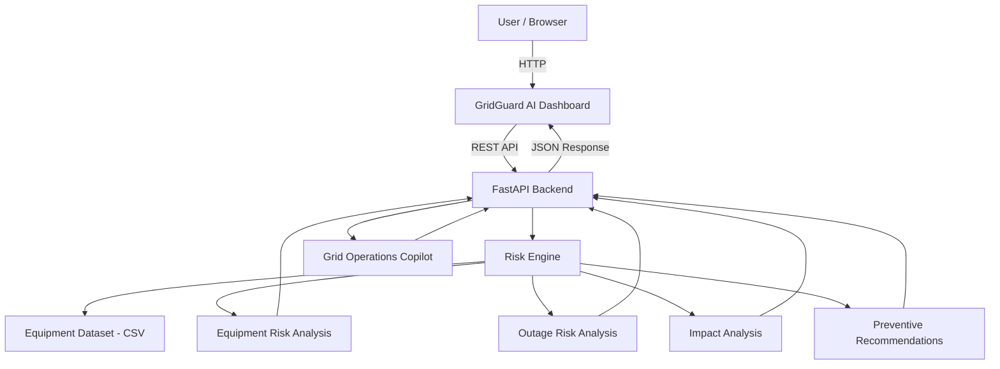

# 🏗️ Architecture

## System Architecture

## Components

| Component | Technology | Responsibility |
|---|---|---|
| **Dashboard** | HTML, CSS, JavaScript | Displays grid overview, risk analysis, vulnerable assets, impact analysis, recommendations, and Copilot |
| **Backend API** | Python, FastAPI | Provides REST APIs, loads equipment data, processes requests, and connects the dashboard with the risk engine |
| **Risk Engine** | Python, Pandas, NumPy | Calculates equipment failure risk, outage risk, impact estimates, and preventive recommendations |
| **Data Source** | CSV | Provides the equipment, maintenance, failure, weather, load, and criticality data used by the prototype |
| **Grid Operations Copilot** | Python rule-based logic | Answers operator queries about critical assets, risks, recommendations, and impact analysis |

## Data Flow

1. **Equipment data** is loaded from the CSV dataset when the FastAPI backend starts.
2. The **Risk Engine** processes equipment factors such as age, load, temperature, maintenance history, failure history, weather, outage history, and criticality.
3. The system calculates separate **equipment failure risk** and **outage risk** scores.
4. Assets are ranked to identify the **Top 10 most vulnerable assets**.
5. For selected assets, the system generates **impact estimates** and **preventive maintenance recommendations**.
6. The **FastAPI backend** exposes these results through REST API endpoints.
7. The **dashboard** requests the API data and displays the results through charts, tables, asset details, and recommendations.
8. The **Grid Operations Copilot** uses rule-based logic to respond to questions about the available risk and asset information.

## Security Considerations

- No API keys or passwords are hard-coded into the application.
- The `.env` file is excluded from Git using `.gitignore`.
- The current prototype does not require authentication for its dashboard APIs.
- The application uses CORS configuration to allow the frontend to communicate with the FastAPI backend.
- Sensitive production credentials and external service integrations would be secured through environment variables in a production deployment.

## Scalability Notes

The current implementation is designed as a lightweight hackathon prototype using in-memory Pandas processing and a CSV dataset. For production deployment, the architecture can be extended with a persistent database, live sensor and weather data ingestion, trained ML models, authentication, background processing, and containerized FastAPI services. The risk engine can also be separated into scalable services to support larger equipment fleets and continuous real-time risk evaluation.